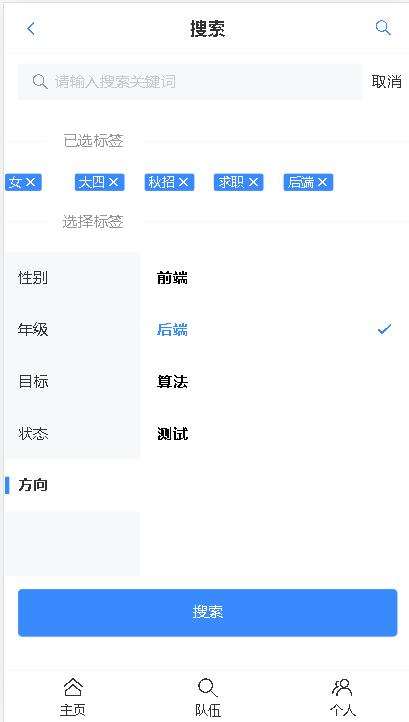
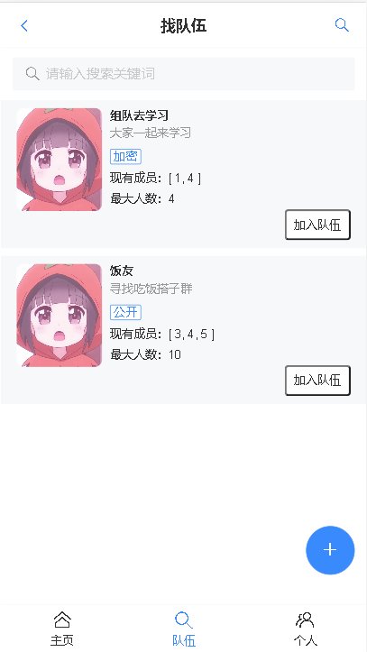
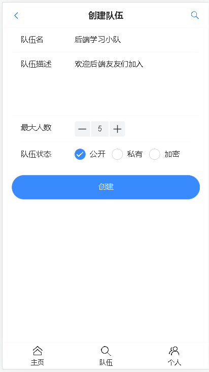
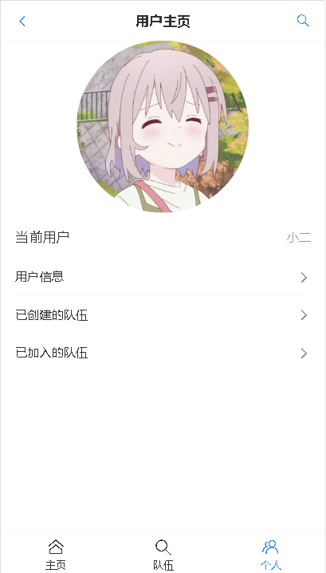
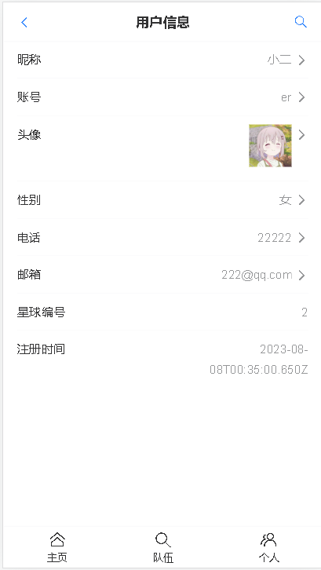

## 项目简介

伙伴网，一个让大家可以找到志同道合的学习伙伴的移动端 H5 网页。包括用户登录注册、更新个人信息、按标签搜索用户、推荐相似用户、组队等功能。

## 项目页面展示：

**伙伴网主页:**

**搜索伙伴:**

**组队功能：**

**创建队伍：**

**后台管理页：**

**用户更新页面：**

### 前端

- Vue 3
- Vant UI 组件库
- TypeScript
- Vite 脚手架

1. 前端使用Vant UI 组件库，并封装了全局通用的Layout组件，使主页、搜索页、组队页布局一致，并减少重复代码。
2. 基于Vue Router 全局路由守卫实现了根据不同页面来动态切换导航栏标题，并通过在全局路由配置文件扩展title字段来减少无意义的 if else 代码。

